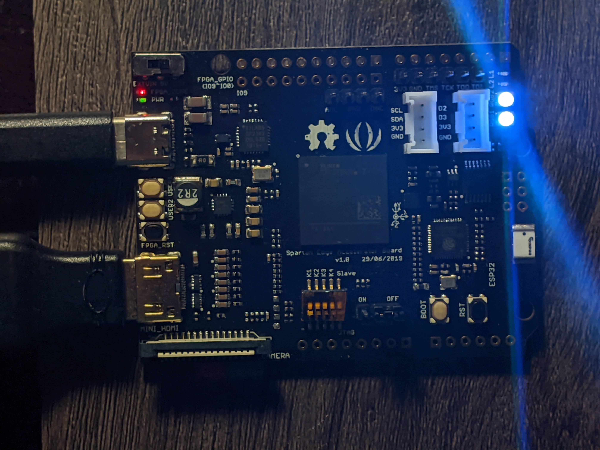

# unipolar-rz

Unipolar return-to-zero driver originally for [SK805-2427 RGB LED](http://www.normandled.com/upload/201810/SK6805-2427%20LED%20Datasheet.pdf) on the Spartan Edge Accelerator Board.

The demo drives R, G and B separately but it appears as white to the naked eye:

A 240 FPS slow-mo video shows the LEDs glimmering as they switch between the colors:

